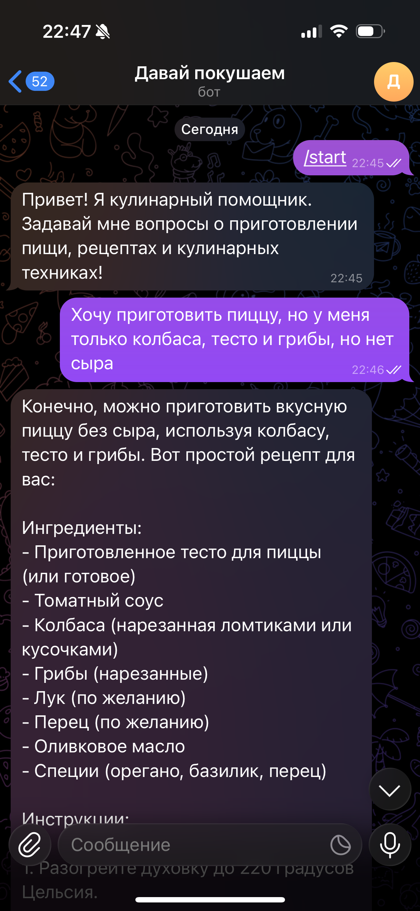

# Проект: LLM-ассистент «Кулинарный помощник»

**Описание:**
LLM-бот для Telegram, который выступает персональным помощником в вопросах приготовления пищи, подсказывает рецепты, техники и лайфхаки для дома. Вся логика реализована строго по принципам простоты (KISS), in-memory хранение истории, прозрачная работа без лишних слоёв, с нуля до MVP за одну AI-ориентированную сессию.

## Роль ИИ-ассистента и её обоснование

**Выбранная роль:** «Кулинарный помощник». 

Ассистент предназначен для пользователей с разным уровнем готовки: помогает быстро найти рецепты, объясняет техники, советует по ингредиентам. Такая специализация выбрана как самая популярная и массовая для первой MVP-версии (универсальна, полезна в быту, легко расширяется под другие ниши).

## Реализованные возможности
- [x] Telegram-бот на aiogram 3.x
- [x] Асинхронная обработка всех текстовых сообщений
- [x] Команда `/start` с приветствием и описанием
- [x] Интеграция с OpenRouter (LLM API)
- [x] Системный промпт с ролью «Кулинарный помощник»
- [x] Ответы от LLM с учётом истории диалога (MVP memory)
- [x] Ограничение объёма истории (max 10 сообщений)
- [x] Команда `/reset` (очистка истории)
- [x] Полное логирование всех ключевых событий, запросов и ошибок
- [x] Защита от пустых сообщений и плохого ввода
- [x] Пользователь всегда получает понятное уведомление об ошибке
- [x] Код полностью PEP8, только функции, только 1 файл логики (`src/bot.py`)

## Технологический стек
- **Язык:** Python 3.11+
- **Бот-фреймворк:** aiogram 3.x (async/polling)
- **Клиент LLM:** openai-python (с base_url для OpenRouter)
- **Хранение истории:** in-memory dict
- **Сборка/запуск:** Makefile, uv

## Инструменты AI-driven разработки
- **AI-coding IDE:** Cursor (AI first Python IDE, Copilot mode)
- **Используемые LLM для кода и документации:**
  * GPT-4o для генерации кода, логики и пояснений
  * GPT-4 и Claude-3 (опционально, на этапе экспериментов)
- **Все итерации и изменения обсуждались, согласовывались и внедрялись с AI в диалоговом режиме**

## Скриншот работы

## Процесс разработки: основные вызовы и решения
- Осознанный выбор минимализма (KISS, YAGNI) и всего в одном файле — позволил быстро и прозрачно отслеживать рабочий MVP
- Проблемы с доступом к некоторым LLM (Anthropic/Claude) обходились подбором доступной модели (GPT-3.5)
- Вся архитектура project-driven: проект описан в vision.md и tasklist.md, линейный прогресс фиксируется по чекбоксам
- Логирование и error handling сделали бота пригодным для диагностики реальных сбоев OpenRouter
- Встроена защита от дурацких/пустых сообщений и крашей на любой пользовательский ввод

## Что узналось нового в процессе AI-driven разработки (выжимка)
1. **AI IDE реально ускоряет MVP** — задания реализуются по формальному плану с проверками, нет тупиков по архитектуре.
2. **Модели LLM несовершенны:** даже подписанные ключи OpenRouter иногда не работают — приходится fallback на стабильный (GPT-3.5), делать try/catch и быстро переключаться.
3. **Тестируемость сессии простая при KISS:** единственный файл логики легко поддерживать и дорабатывать (вся память — dict).
4. **Формализация workflow важна:** чеклисты/тасклисты — повышают повторяемость процесса и вычищают хаос.
5. **AI как напарник в dialog mode** помогает держать скорость, видеть ошибки, не перегружать и не усложнять архитектуру.

## Ссылка на бота
[https://t.me/davaipokushaem_bot](https://t.me/davaipokushaem_bot) (работает не всегда, так как запущен локально)
