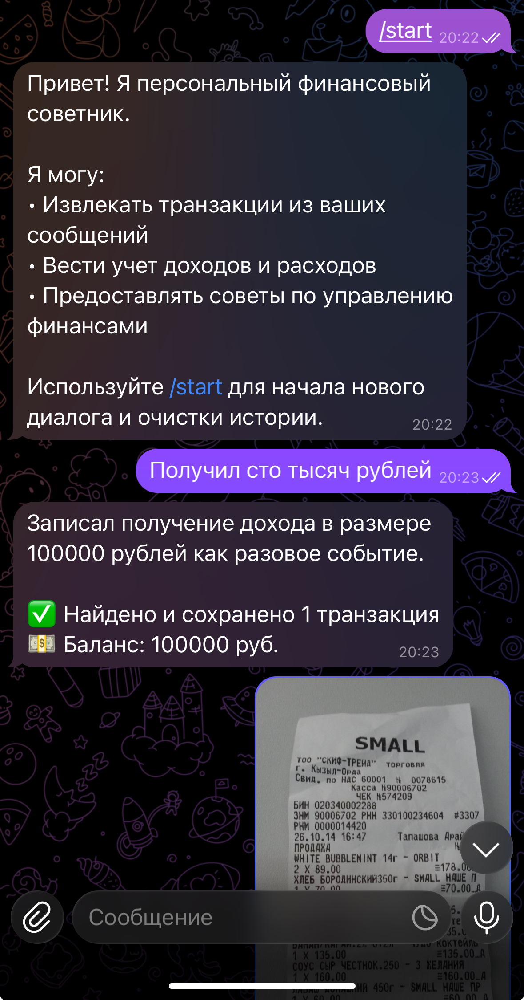
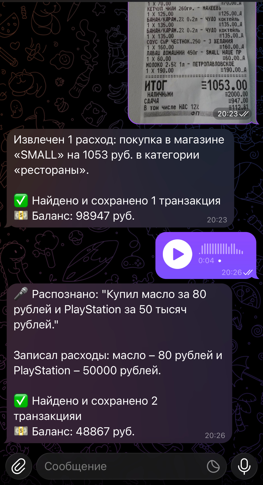

# Отчёт о выполнении задания: Персональный финансовый советник

## Информация о проекте

**Название проекта:** Персональный финансовый советник  
**Вариант задания:** Базовый  
**Дата выполнения:** 16 ноября 2025 г.

## Описание проекта

Telegram-бот для автоматического учета доходов и расходов с интеграцией LLM. Бот извлекает финансовые транзакции из текстовых сообщений, изображений чеков и голосовых сообщений, автоматически категоризирует их и предоставляет отчеты о балансе.

## Реализованные возможности

- [x] Извлечение транзакций из текстовых сообщений
- [x] Обработка изображений чеков и скриншотов
- [x] Транскрибация голосовых сообщений (Faster-Whisper)
- [x] Автоматическая категоризация транзакций
- [x] Отчеты о балансе и статистике по категориям
- [x] История всех транзакций
- [x] Поддержка локальных моделей через Ollama
- [x] Поддержка облачных моделей через OpenRouter
- [x] Structured output для надежного извлечения данных
- [x] Мультимодальная обработка (текст, изображения, голос)

## Технологический стек

### Языки и фреймворки
- **Python 3.11+** - основной язык разработки
- **uv** - современный менеджер зависимостей и виртуальных окружений

### Библиотеки
- **aiogram 3.x** - асинхронный фреймворк для Telegram Bot API
- **openai** - клиент для работы с LLM (единый интерфейс для OpenRouter и Ollama)
- **pydantic** - валидация данных и structured output
- **python-dotenv** - управление переменными окружения
- **faster-whisper** - оптимизированная транскрибация аудио

### LLM модели

**Текстовые сообщения:**
- `qwen2.5:7b-instruct` (Ollama) - основная модель для извлечения транзакций

**Изображения:**
- `qwen3-vl:8b-instruct` (Ollama) - vision-модель для обработки чеков

**Голосовые сообщения:**
- `Faster-Whisper base` - локальная транскрибация на CPU

### Архитектурные принципы
- **KISS** (Keep It Simple, Stupid) - максимальная простота
- **YAGNI** (You Aren't Gonna Need It) - только необходимый функционал
- Монолитная архитектура (6 Python-файлов)
- Прямолинейный код без избыточных абстракций

## Инструменты AI-driven разработки

### IDE и расширения
- **VS Code** - основная среда разработки
- **GitHub Copilot** - AI-ассистент для написания кода
- **Pylance** - языковой сервер для Python с AI-подсказками

### LLM модели для разработки
- **GitHub Copilot** - автодополнение кода, генерация функций
- **Claude/GPT-4** - архитектурные решения, документация, отладка

### Процесс разработки
1. Проектирование архитектуры с помощью AI
2. Генерация базового кода через Copilot
3. Итеративная разработка с AI-подсказками
4. Автоматическое создание документации
5. Рефакторинг с помощью AI

## Скриншоты работы

### Работа бота


### Работа бота


## Облачный сервер

### Провайдер и конфигурация
- **Провайдер:** Удаленный сервер
- **IP:** 195.209.214.166
- **GPU:** NVIDIA RTX 4090
- **Сервис:** Ollama для LLM моделей

### Развернутые модели Ollama
1. **qwen2.5:7b-instruct** - для обработки текстовых сообщений
   - Размер: ~4.7 GB
   - Поддержка structured output
   - Быстрая обработка запросов

2. **qwen3-vl:8b-instruct** - для обработки изображений
   - Размер: ~5.2 GB
   - Vision capabilities
   - OCR и понимание контекста изображений

### Архитектура развертывания
```
Telegram Bot (локально) 
    ↓
Ollama API (195.209.214.166:11434 + RTX 4090)
    ↓
LLM модели (qwen2.5, qwen3-vl) на GPU

Faster-Whisper (локально на CPU)
```

### Использование GPU
- **LLM модели** работают на RTX 4090 на удаленном сервере
- **Faster-Whisper** работает локально на CPU (можно перенести на сервер для ускорения)

## Основные вызовы и решения

### 1. Structured Output для надежного извлечения данных
**Вызов:** Необходимость гарантированного получения структурированных данных от LLM.

**Решение:** 
- Использование Pydantic моделей для валидации
- JSON Schema через `response_format` в OpenAI API
- Строгая типизация полей транзакций

### 2. Мультимодальная обработка
**Вызов:** Единая обработка текста, изображений и голоса.

**Решение:**
- Двухэтапная архитектура для голоса (транскрибация → LLM)
- Использование vision-моделей для изображений
- Единый pipeline для всех типов входных данных

### 3. Работа с удаленным Ollama
**Вызов:** Интеграция с удаленным сервером Ollama.

**Решение:**
- Единый интерфейс через OpenAI client
- Переключение между провайдерами через конфигурацию
- Обработка сетевых ошибок и таймаутов

### 4. Транскрибация на CPU
**Вызов:** Отсутствие GPU для Faster-Whisper.

**Решение:**
- Использование модели `base` для баланса скорости/качества
- Оптимизация через CTranslate2 и int8
- Voice Activity Detection для улучшения качества

### 5. Управление контекстом диалога
**Вызов:** Сохранение истории для контекстных ответов.

**Решение:**
- Хранение истории в памяти (dict)
- Ограничение контекста последними 10 сообщениями
- Разделение системных промптов для текста и изображений

## Что узнал нового

### 1. Structured Output в LLM
Освоил использование JSON Schema для гарантированного получения структурированных данных от LLM. Это критически важно для production-приложений, где нужна надежность парсинга ответов.

### 2. Faster-Whisper и оптимизация на CPU
Узнал о CTranslate2 и методах оптимизации Whisper для работы на CPU. Понял разницу между compute types (int8, float16) и их влияние на скорость/качество.

### 3. Единый интерфейс для разных LLM провайдеров
Научился создавать абстракцию над разными провайдерами (OpenRouter, Ollama) через единый OpenAI-совместимый интерфейс. Это упрощает переключение между облачными и локальными моделями.

### 4. Vision-модели и обработка изображений
Получил опыт работы с мультимодальными моделями для OCR и понимания контекста изображений. Узнал о передаче изображений через base64 в API.

### 5. Принципы KISS и YAGNI в AI-проектах
Понял важность простоты архитектуры даже при работе со сложными AI-моделями. Монолитный подход с 6 файлами оказался эффективнее микросервисной архитектуры для MVP.

### 6. Управление зависимостями через uv
Освоил современный инструмент uv для управления Python-зависимостями. Он значительно быстрее pip и poetry, что ускоряет разработку.

### 7. Асинхронная обработка в Telegram ботах
Углубил знания в aiogram 3.x и асинхронном программировании. Научился правильно обрабатывать разные типы сообщений (текст, фото, голос) через фильтры и роутеры.

## Выводы

Проект успешно демонстрирует возможности мультимодальной обработки данных с помощью LLM. Использование локальных моделей через Ollama обеспечивает приватность и отсутствие затрат на API, а Faster-Whisper позволяет добавить транскрибацию голоса без необходимости GPU.

Ключевым достижением стала реализация надежного извлечения структурированных данных через Pydantic и JSON Schema, что делает бота пригодным для реального использования.

Архитектурные принципы KISS и YAGNI позволили создать простое, но функциональное решение за короткое время, что особенно важно для MVP и прототипирования.
