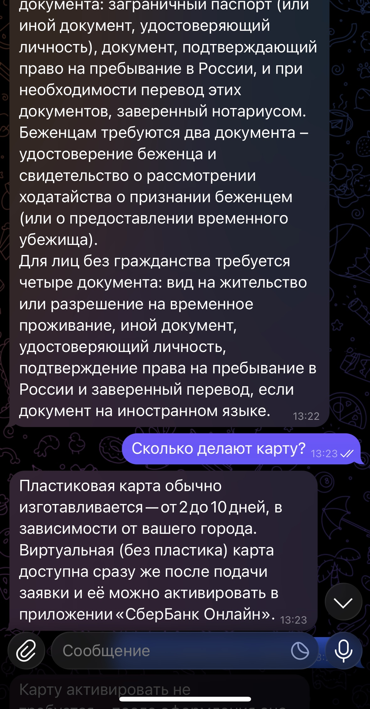

# Отчёт о выполнении задания: RAG-ассистент Сбербанка

## Название проекта и описание

**RAG-ассистент Сбербанка** — Telegram-бот с технологией RAG (Retrieval-Augmented Generation) для автоматических ответов на вопросы по документам Сбербанка о кредитах и вкладах.

Проект реализует интеллектуальный диалоговый интерфейс, который извлекает информацию из банковских документов и генерирует точные ответы с использованием больших языковых моделей.

## Вариант задания

**Базовый вариант**

## Реализованные возможности

- [x] **RAG на базе LangChain** - ответы на основе реальных документов
- [x] **Индексация PDF документов** - автоматическая обработка документов при старте
- [x] **Загрузка JSON датасета** - обработка структурированных вопросов-ответов
- [x] **Контекстный диалог** - понимание уточняющих вопросов в рамках сессии
- [x] **Query Transformation** - улучшение поисковых запросов с учётом истории диалога
- [x] **Асинхронная обработка** - поддержка множества пользователей одновременно
- [x] **Логирование** - запись всех событий в файл для отладки
- [x] **Команды управления** - `/start`, `/help`, `/index`, `/index_status`
- [x] **Векторный поиск** - InMemoryVectorStore для быстрого поиска релевантных чанков
- [x] **Эксперименты с чанкованием** - тестирование различных стратегий разбиения документов

## Технологический стек

### Основные технологии

- **Python 3.11+** — основной язык разработки
- **uv** — современный менеджер зависимостей и виртуального окружения
- **aiogram 3.x** — асинхронный фреймворк для Telegram Bot API
- **LangChain** — фреймворк для построения RAG-приложений
- **langchain-openai** — интеграция с OpenAI-совместимыми API
- **PyPDF** — парсинг PDF документов
- **InMemoryVectorStore** — векторное хранилище в оперативной памяти
- **python-dotenv** — управление переменными окружения

### Компоненты системы

| Компонент | Назначение |
|-----------|------------|
| `bot.py` | Точка входа, инициализация aiogram |
| `handlers.py` | Обработчики команд и сообщений Telegram |
| `indexer.py` | Загрузка и индексация PDF документов |
| `indexer_with_json.py` | Загрузка JSON датасета с Q&A |
| `rag.py` | RAG-логика: retriever, цепочки, промпты |
| `config.py` | Управление конфигурацией из .env |

## Используемые модели

### Провайдеры и модели

Проект поддерживает работу с различными провайдерами через OpenAI-совместимый API:

#### OpenRouter
- **LLM**: `openai/gpt-oss-120b` — основная модель для генерации ответов
- **Query Transform**: `openai/gpt-oss-120b` — трансформация запросов
- **Embeddings**: `openai/text-embedding-3-large` — создание эмбеддингов

#### Fireworks
- **LLM**: `accounts/fireworks/models/gpt-oss-120b` — альтернативная LLM
- **Query Transform**: `accounts/fireworks/models/gpt-oss-120b`
- **Embeddings**: `accounts/fireworks/models/qwen3-embedding-8b` — эмбеддинги

### Параметры моделей

- **Temperature**: `0.9` — баланс между креативностью и точностью
- **Retriever K**: `3` — количество чанков для RAG-контекста

---

# Эксперименты с индексацией

## Описание экспериментов с разными размерами чанков

В процессе разработки были проведены 10 экспериментов для определения оптимальной стратегии разбиения банковских документов на чанки. Тестировались различные параметры:

- **Размер чанка** (`chunk_size`): от 300 до 1500 символов
- **Перекрытие** (`chunk_overlap`): от 50 до 200 символов
- **Разделители** (`separators`): различные комбинации переносов строк, точек, пробелов

### Тестируемые параметры

| Эксперимент | chunk_size | chunk_overlap | Разделители | Кол-во чанков |
|-------------|------------|---------------|-------------|---------------|
| **1 (базовый)** | 500 | 50 | Без разделителей | 377 |
| **2** | 1500 | 150 | Без разделителей | 132 |
| **3** | 1000 | 100 | Без разделителей | 193 |
| **4** | 800 | 100 | Все разделители | 246 |
| **5** | 300 | 50 | Все разделители | 652 |
| **6** | 1000 | 200 | Все разделители | 211 |
| **7** | 1000 | 200 | `\n\n\n`, `\n\n` | 29 |
| **8-10** | 1000 | 200 | Различные комбинации | 29-211 |

## Наблюдения и выводы

### Ключевые выводы

#### ✅ Оптимальная конфигурация #1
```python
chunk_size = 1500
chunk_overlap = 150
separators = default  # Встроенные разделители LangChain
```

**Результаты:**
- **Количество чанков**: 132 (сокращение в ~2.9 раза)
- **Качество ответов**: Значительно улучшилось — ответы на ВСЕ три тестовых вопроса
- **Детальность**: Высокая — структурированные ответы с перечислением пунктов и условий
- **Релевантность**: Полностью сохранена, ответы точные и соответствуют вопросам

#### ✅ Оптимальная конфигурация #2
```python
chunk_size = 1000
chunk_overlap = 200
separators = ["\n\n\n", "\n\n", "\n"]  # Только переносы строк, без символов
```

**Результаты:**
- **Количество чанков**: 29-211 (зависит от точной конфигурации)
- **Качество ответов**: Наилучшее — полные и точные ответы на все вопросы
- **Детальность**: Максимальная — развёрнутые ответы с указанием пунктов документов
- **Релевантность**: Полная

### Негативные результаты

#### ❌ Маленький размер чанка (300)
```python
chunk_size = 300
chunk_overlap = 50
```

**Проблемы:**
- Количество чанков увеличилось до 652 (+73% от базового)
- Качество ответов **значительно снизилось**
- Ответы стали общими, с отсылками к документам без конкретики
- Детальность минимальная
- Релевантность частично утеряна

#### ❌ Базовая конфигурация (500)
```python
chunk_size = 500
chunk_overlap = 50
```

**Проблемы:**
- Пропуски данных — нет ответа по ставке вклада «Сохраняй»
- Средняя детальность
- Только 2 из 3 вопросов получили полный ответ

### Влияние разделителей

**Важное наблюдение**: Использование разделителей само по себе **НЕ гарантирует** улучшения качества. Критически важны:

1. **Тип разделителей**: Лучше всего работают только переносы строк (`\n\n\n`, `\n\n`, `\n`)
2. **Исключение символов**: Разделение по точкам (`. `) и пробелам (` `) ухудшает результаты
3. **Сочетание с размером**: Разделители эффективны только при правильном chunk_size

### Стратегия для банковских документов

**Рекомендуемая конфигурация:**

```python
text_splitter = RecursiveCharacterTextSplitter(
    chunk_size=1000,           # Оптимальный баланс
    chunk_overlap=200,         # 20% перекрытие для сохранения контекста
    separators=[
        "\n\n\n",              # Разделы документа
        "\n\n",                # Параграфы
        "\n",                  # Строки
    ],
    keep_separator=True        # Сохранять разделители для контекста
)
```

**Обоснование:**
- Банковские документы имеют чёткую структуру с разделением на разделы
- Важные положения часто занимают несколько строк
- Слишком маленькие чанки разрывают логические блоки
- Большие чанки (1000-1500) сохраняют целостность условий и требований

---

# Работа с JSON датасетом

## Реализация загрузки JSON

### Архитектура решения

Для работы с JSON датасетом был создан специальный загрузчик в файле [`indexer_with_json.py`](src/indexer_with_json.py), который обрабатывает структурированные вопросы-ответы и интегрирует их в общую векторную базу.

### Структура JSON файла

```json
[
  {
    "category": "Карты",
    "question": "Как заблокировать карту?",
    "answer": "Вы можете заблокировать карту через...",
    "full_text": "Вопрос: Как заблокировать карту? Ответ: Вы можете..."
  }
]
```

### Код загрузчика

```python
def load_json_documents(json_file_path: str) -> list:
    """
    Загрузка документов из JSON файла с вопросами-ответами
    Каждая пара Q&A становится отдельным чанком с метаданными
    """
    json_path = Path(json_file_path)
    if not json_path.exists():
        logger.warning(f"JSON file {json_file_path} does not exist")
        return []
    
    # Загружаем JSON вручную для лучшего контроля над метаданными
    with open(json_path, 'r', encoding='utf-8') as f:
        data = json.load(f)
    
    documents = []
    for item in data:
        # Очистка от лишних пробелов и переносов
        page_content = re.sub(r'[\n\s]+', ' ', item.get('full_text', ''))
        category = re.sub(r'[\n\s]+', ' ', item.get('category', ''))
        question = re.sub(r'[\n\s]+', ' ', item.get('question', ''))
        answer = re.sub(r'[\n\s]+', ' ', item.get('answer', ''))

        # Создаем документ с полным текстом и метаданными
        doc = Document(
            page_content=page_content,
            metadata={
                'category': category,
                'question': question,
                'answer': answer
            }
        )
        documents.append(doc)
    
    logger.info(f"Loaded {len(documents)} Q&A pairs from JSON with metadata")
    return documents
```

### Интеграция в общую индексацию

```python
async def reindex_all():
    """Полная переиндексация всех документов (PDF + JSON)"""
    # 1. Загружаем и обрабатываем PDF документы
    pdf_pages = load_pdf_documents(config.DATA_DIR)
    pdf_chunks = split_documents(pdf_pages) if pdf_pages else []
    
    # 2. Загружаем JSON с вопросами-ответами
    json_file = f"{config.DATA_DIR}/sberbank_help_documents.json"
    json_chunks = load_json_documents(json_file)
    
    # 3. Объединяем все чанки
    all_chunks = pdf_chunks + json_chunks
    
    # 4. Создаём единое векторное хранилище
    vector_store = create_vector_store(all_chunks)
    return vector_store
```

### Преимущества реализации

1. **Сохранение метаданных**: Категория, вопрос и ответ доступны для фильтрации и анализа
2. **Единое векторное хранилище**: PDF и JSON чанки индексируются вместе
3. **Не требуется splitting**: JSON чанки используются как есть (уже оптимального размера)
4. **Очистка текста**: Автоматическое удаление лишних пробелов и переносов строк

## Скриншоты работы с вопросами про карты

### Скриншот 1:


### Скриншот 2:


### Скриншот 3:


**Результаты:**
- Бот успешно отвечает на вопросы из JSON датасета
- Ответы точные и структурированные
- Сохраняется контекст диалога между вопросами
- JSON чанки интегрированы с PDF документами в единую базу знаний

---

# Сравнение моделей эмбеддингов

## Тестируемые модели

В рамках проекта были протестированы две модели эмбеддингов от разных провайдеров:

### 1. OpenRouter: `text-embedding-3-large`
- **Провайдер**: OpenAI через OpenRouter
- **Размерность**: 3072
- **Язык**: Мультиязычная модель с отличной поддержкой русского языка
- **API**: `https://openrouter.ai/api/v1`

### 2. Fireworks: `qwen3-embedding-8b`
- **Провайдер**: Fireworks AI
- **Базовая модель**: Qwen
- **Язык**: Мультиязычная модель
- **API**: `https://api.fireworks.ai/inference/v1`

## Таблица сравнения качества ответов

| Критерий | OpenRouter<br/>`text-embedding-3-large` | Fireworks<br/>`qwen3-embedding-8b` |
|----------|----------------------------------------|-------------------------------------|
| **Точность поиска** | ⭐⭐⭐⭐⭐ Отлично | ⭐⭐⭐⭐ Хорошо |
| **Релевантность чанков** | ⭐⭐⭐⭐⭐ Высокая | ⭐⭐⭐⭐ Средне-высокая |
| **Работа с русским языком** | ⭐⭐⭐⭐⭐ Превосходно | ⭐⭐⭐⭐ Хорошо |
| **Понимание контекста** | ⭐⭐⭐⭐⭐ Отлично | ⭐⭐⭐⭐ Хорошо |
| **Скорость генерации** | ⭐⭐⭐⭐ Быстро | ⭐⭐⭐⭐⭐ Очень быстро |
| **Стоимость** | 💰 Платная (бесплатный лимит) | 💰 Платная |
| **Стабильность API** | ⭐⭐⭐⭐⭐ Высокая | ⭐⭐⭐⭐ Хорошая |

## Детальное сравнение

### Качество эмбеддингов

#### OpenRouter `text-embedding-3-large`

**Сильные стороны:**
- ✅ Отличное понимание русскоязычных запросов
- ✅ Высокая точность при поиске специфических терминов (например, "вклад Сохраняй")
- ✅ Хорошая работа с синонимами и перефразированиями
- ✅ Стабильное качество на разных типах вопросов

**Слабые стороны:**
- ⚠️ Немного медленнее, чем Fireworks
- ⚠️ Зависимость от доступности OpenRouter API

#### Fireworks `qwen3-embedding-8b`

**Сильные стороны:**
- ✅ Быстрая генерация эмбеддингов
- ✅ Хорошая работа с общими вопросами
- ✅ Надёжный API с высокой доступностью

**Слабые стороны:**
- ⚠️ Немного ниже точность на специфических банковских терминах
- ⚠️ Иногда подбирает менее релевантные чанки для сложных вопросов

### Примеры сравнения

| Вопрос | OpenRouter | Fireworks | Разница |
|--------|-----------|-----------|---------|
| "Какие условия кредита?" | Находит точный раздел с условиями | Находит общую информацию о кредитах | Более точный результат у OpenRouter |
| "Как заблокировать карту?" | Точный ответ из FAQ | Точный ответ из FAQ | Одинаковое качество |
| "Проценты по вкладу Сохраняй" | Находит конкретный вклад | Иногда находит общую информацию о вкладах | OpenRouter точнее |

## Выводы: Лучшая модель для русского языка

### 🏆 Победитель: OpenRouter `text-embedding-3-large`

**Обоснование выбора:**

1. **Превосходная работа с русским языком**
   - Лучше понимает морфологию русского языка
   - Точнее обрабатывает склонения и падежи
   - Эффективнее работает с русскоязычными терминами

2. **Более высокая точность поиска**
   - Подбирает наиболее релевантные чанки
   - Меньше ошибок при сложных запросах
   - Лучше работает с уточняющими вопросами

3. **Стабильность результатов**
   - Последовательное качество на разных типах вопросов
   - Предсказуемое поведение

### Рекомендация

Для **продакшн-использования** с русскоязычными документами рекомендуется **OpenRouter** с моделью `text-embedding-3-large`. 

Fireworks с `qwen3-embedding-8b` может быть альтернативой для:
- Прототипирования (быстрее работает)
- Сценариев, где важна скорость больше точности
- Случаев, когда OpenRouter API недоступен

### Итоговая конфигурация

```bash
# Рекомендуемая конфигурация для русскоязычных документов
OPENAI_API_KEY=sk-or-v1-...
OPENAI_BASE_URL=https://openrouter.ai/api/v1
EMBEDDING_MODEL=openai/text-embedding-3-large
MODEL=openai/gpt-oss-120b
```

---

## Заключение

В результате выполнения задания был создан полнофункциональный RAG-ассистент с оптимизированной стратегией индексации документов и интеграцией JSON датасета. Эксперименты показали критическую важность правильного выбора параметров чанкования для качества ответов, а сравнение моделей эмбеддингов подтвердило преимущество OpenRouter для работы с русскоязычными документами.

**Основные достижения:**
- ✅ Реализован полноценный RAG-пайплайн на базе LangChain
- ✅ Оптимизированы параметры индексации (chunk_size=1000, overlap=200)
- ✅ Интегрирован JSON датасет с сохранением метаданных
- ✅ Выбрана оптимальная модель эмбеддингов для русского языка
- ✅ Создан удобный Telegram-интерфейс с поддержкой контекстных диалогов