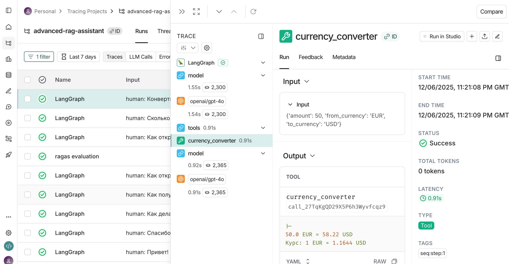

# Отчет: Реализация ReAct агента с инструментом конвертации валют

## 1. Реализованный инструмент

### Currency Converter (`currency_converter`)

Был реализован инструмент для конвертации валют с использованием реального API exchangerate-api.com.

**Основные характеристики:**
- **Декоратор:** `@tool` из LangChain для автоматической интеграции с агентом
- **Параметры:** 
  - `amount` (float) - сумма для конвертации
  - `from_currency` (str) - исходная валюта (USD, EUR, RUB и др.)
  - `to_currency` (str) - целевая валюта
- **Возвращаемое значение:** Строка с результатом конвертации и текущим курсом
- **Внешний API:** https://v6.exchangerate-api.com/v6/{api_key}/pair/{from}/{to}/{amount}

**Обработка ошибок:**
- Проверка наличия API ключа
- Обработка таймаутов (timeout=10 секунд)
- Обработка ошибок HTTP запросов
- Логирование всех операций

**Пример работы:**
```
Запрос: "Сколько будет 100 долларов в рублях?"
Вызов: currency_converter(amount=100, from_currency='USD', to_currency='RUB')
Результат: 100.0 USD = 7692.17 RUB, Курс: 1 USD = 76.9217 RUB
```



## 2. Как агент принимает решения о вызове инструментов

### ReAct Pattern (Reasoning + Acting)

Агент использует паттерн ReAct, который работает в цикле:

**1. Reasoning (Рассуждение):**
- Агент получает вопрос пользователя через `HumanMessage`
- LLM анализирует вопрос и контекст диалога
- Принимает решение: нужен ли инструмент или можно ответить напрямую

**2. Acting (Действие):**
- Если нужен инструмент - генерирует `AIMessage` с `tool_calls`
- Выполняется вызов инструмента, результат возвращается в `ToolMessage`
- Агент получает результат и формирует финальный ответ

**3. Повторение цикла:**
- Агент может вызвать несколько инструментов подряд
- Может вызвать один инструмент несколько раз с разными параметрами
- Цикл продолжается до получения достаточной информации для ответа

### Примеры

**Пример 1: Вопрос о банковском продукте**
```
Вопрос: "Как открыть вклад?"
Шаг 1: HumanMessage - получен вопрос
Шаг 2: AIMessage - агент решил использовать rag_search
        Tool: rag_search, Args: {'query': 'как открыть вклад в Сбербанке'}
Шаг 3: ToolMessage - получен результат из документов
Шаг 4: AIMessage - финальный ответ на основе найденной информации
```

**Пример 2: Вопрос о конвертации валют**
```
Вопрос: "Сколько будет 100 долларов в рублях?"
Шаг 1: HumanMessage - получен вопрос
Шаг 2: AIMessage - агент решил использовать currency_converter
        Tool: currency_converter, Args: {'amount': 100, 'from_currency': 'USD', 'to_currency': 'RUB'}
Шаг 3: ToolMessage - получен результат: 100.0 USD = 7692.17 RUB
Шаг 4: AIMessage - финальный ответ с форматированием
```

**Пример 3: Другой запрос конвертации**
```
Вопрос: "Конвертируй 50 евро в доллары"
Шаг 1: HumanMessage - получен вопрос
Шаг 2: AIMessage - агент решил использовать currency_converter
        Tool: currency_converter, Args: {'amount': 50, 'from_currency': 'EUR', 'to_currency': 'USD'}
Шаг 3: ToolMessage - получен результат: 50.0 EUR = 58.22 USD
Шаг 4: AIMessage - финальный ответ
```

### Системный промпт

Решения агента направляются системным промптом (`prompts/agent_system.txt`), который определяет:
- **Когда использовать `rag_search`:** вопросы о кредитах, вкладах, банковских продуктах
- **Когда НЕ использовать инструменты:** приветствия, благодарности, простые уточнения
- **Правила ответов:** вежливость, конкретность, честность при отсутствии информации

Для `currency_converter` агент самостоятельно определяет необходимость использования на основе семантики вопроса (упоминание валют, конвертации, курса).


## 3. Отличия агента от простой RAG-цепочки

### Простая RAG-цепочка (Linear Chain)

```
Вопрос → Retrieval → LLM → Ответ
```

**Характеристики:**
- Линейный процесс без ветвления
- Всегда выполняет retrieval, даже если не нужен
- Не может принимать решения о необходимости поиска
- Не может вызывать несколько источников данных
- Не может повторять поиск с уточненными запросами

### ReAct Агент (Agentic Workflow)

```
Вопрос → [Рассуждение → Решение → Действие]* → Ответ
```

**Ключевые отличия:**

1. **Динамическое принятие решений:**
   - Агент сам решает, нужен ли поиск в документах
   - Может ответить без инструментов на простые вопросы
   - Выбирает подходящий инструмент из доступных

2. **Множественные инструменты:**
   - RAG-цепочка: только один источник данных (векторная БД)
   - Агент: может использовать `rag_search`, `currency_converter` и другие инструменты
   - Может комбинировать результаты разных инструментов

3. **Итеративный процесс:**
   - Может вызвать инструмент несколько раз
   - Может уточнить запрос на основе первого результата
   - Может использовать результат одного инструмента для вызова другого

4. **Контекстная память:**
   - `MemorySaver` сохраняет историю диалога по `thread_id` (chat_id)
   - Агент помнит предыдущие вопросы и ответы
   - Может отвечать на уточняющие вопросы без повторного поиска

5. **Гибкость в обработке:**
   - RAG-цепочка: всегда один и тот же путь выполнения
   - Агент: адаптирует стратегию под каждый вопрос

### Пример различий

**Вопрос: "Спасибо!"**
- **RAG-цепочка:** Выполнит поиск в документах → потратит время и токены впустую
- **Агент:** Сразу ответит "Пожалуйста!" без вызова инструментов

**Вопрос: "Какой процент по вкладу и сколько это будет в долларах?"**
- **RAG-цепочка:** Может найти информацию о проценте, но не сможет конвертировать
- **Агент:** Вызовет `rag_search` для процента, затем `currency_converter` для конвертации

## 4. Преимущества и ограничения

### ✅ Преимущества

1. **Интеллектуальное использование ресурсов:**
   - Не вызывает инструменты без необходимости
   - Экономит API вызовы и время обработки
   - Пример: на приветствие отвечает мгновенно без поиска

2. **Расширяемость:**
   - Легко добавлять новые инструменты (как `currency_converter`)
   - Агент автоматически учится их использовать через описание в docstring
   - Не требует переписывания логики

3. **Многошаговое рассуждение:**
   - Может разбить сложный вопрос на подзадачи
   - Может искать дополнительную информацию если первого результата недостаточно
   - Адаптивная стратегия решения задач

4. **Контекстная осведомленность:**
   - Помнит историю диалога
   - Может отвечать на "А сколько это в евро?" после вопроса о долларах
   - Поддерживает естественный диалог

5. **Прозрачность:**
   - Детальное логирование каждого шага (HumanMessage → AIMessage → ToolMessage)
   - Видно какие решения принимает агент и почему
   - Упрощает отладку и улучшение

6. **Комбинирование источников:**
   - Может использовать внутренние документы (RAG) и внешние API
   - Объединяет структурированные и неструктурированные данные
   - Расширяет возможности ответов

### ⚠️ Ограничения

1. **Производительность:**
   - Каждый шаг рассуждения = дополнительный вызов LLM
   - Время ответа: 3-5 секунд (vs 1-2 секунды у простой RAG-цепочки)
   - Больше токенов на обработку (выше стоимость)

2. **Непредсказуемость:**
   - LLM может принять неоптимальное решение
   - Может не вызвать инструмент когда нужно
   - Может вызвать инструмент с неправильными параметрами

3. **Зависимость от качества промпта:**
   - Системный промпт критически важен для правильных решений
   - Требует тщательной настройки и тестирования
   - Изменение промпта может сломать поведение

4. **Сложность отладки:**
   - Недетерминированное поведение (разные ответы на один вопрос)
   - Сложнее воспроизвести ошибки
   - Требует обширного логирования

5. **Стоимость:**
   - Больше вызовов LLM = выше стоимость
   - Особенно заметно при использовании дорогих моделей (GPT-4)
   - Нужен баланс между качеством и ценой

6. **Требования к модели:**
   - Нужна достаточно умная модель для правильных решений
   - Слабые модели могут делать ошибки в рассуждениях
   - Не все модели хорошо работают с function calling

7. **Ограничения инструментов:**
   - Качество ответа зависит от качества инструментов
   - Ошибки в инструментах (например, таймаут API) влияют на весь ответ
   - Нужна надежная обработка ошибок в каждом инструменте

### Наблюдения из тестирования

**Положительные:**
- Агент корректно определяет необходимость конвертации валют
- Правильно извлекает параметры из естественного языка (100 долларов → amount=100, from_currency='USD')
- Форматирует ответ в читаемом виде, добавляя контекст к результату инструмента

**Области для улучшения:**
- Время ответа можно оптимизировать через streaming ответов
- Можно добавить кэширование частых запросов (например, курсов валют)
- Стоит добавить fallback стратегии при недоступности внешних API

## Заключение

ReAct агент представляет собой значительный шаг вперед по сравнению с простой RAG-цепочкой. Он обеспечивает гибкость, расширяемость и интеллектуальное использование ресурсов, но требует более тщательной настройки и мониторинга. Для банковского ассистента такой подход оправдан, так как позволяет обрабатывать разнообразные запросы (от вопросов о продуктах до конвертации валют) в едином интерфейсе.

Добавление инструмента `currency_converter` продемонстрировало легкость расширения функциональности агента - потребовалось только:
1. Реализовать функцию с декоратором `@tool`
2. Добавить её в список инструментов
3. Агент автоматически научился её использовать

Это подтверждает архитектурное преимущество агентного подхода для построения масштабируемых AI-ассистентов.
